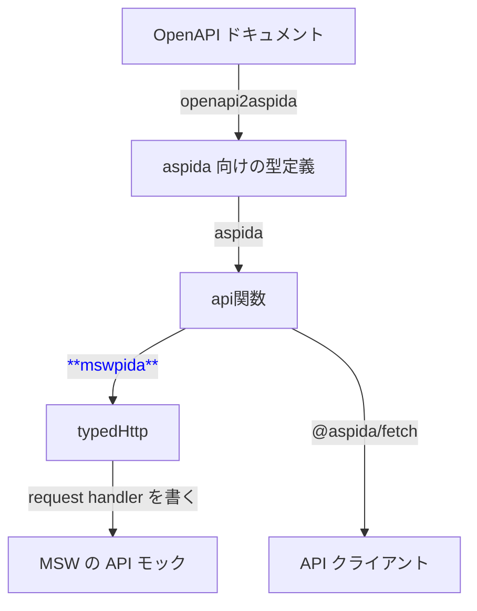

[aspida](https://github.com/aspida/aspida) の型情報を元にして、MSW の API モックを型安全に（そして楽に）書ける npm パッケージ、**mswpida** を作りました。

https://www.npmjs.com/package/mswpida

我ながら便利なものを作ってしまったので、この記事で紹介していきます。

## 使い方

使い方はこんな感じです。**パスパラメータ・リクエストボディ・レスポンスボディに自動で型がつきます**。型注釈を手で書く必要はありません。

```ts:mswpida の使い方
/*
 * 1. aspida で生成した `api` 関数から `typedHttp` を作る
 */

import { createTypedHttp } from "mswpida";
import api from "./awesome/store/$api";

const typedHttp = createTypedHttp(api);

/*
 * 2. `typedHttp` を使って MSW の request handler を書く
 */

import { HttpResponse } from "msw";

const handler = typedHttp.products._productId.images.$post(
  async ({ request, params }) => {
    // パスパラメータに型がついている ✅
    console.log(`Add an image to product ${params.productId}`);
    // リクエストボディに型がついている ✅
    const reqBody = await request.json();
    console.log(`Image description: ${reqBody.description}`);
    // レスポンスボディにも型がついている ✅
    return HttpResponse.json({ id: 123, ...reqBody }, { status: 201 });
  }
);
```

上で定義した [request handler](https://mswjs.io/docs/concepts/request-handler)

```ts
typedHttp.products._productId.images.$post(resolver);
```

は、素の MSW でいう

```ts
http.post("https://example.com/products/:productId/images", resolver);
```

と同じ動きをしますが、何もしなくても型がついています。よって、型チェックでミスを防ぐことができます。


_レスポンスボディ上のプロパティ不足が型チェックに引っかかった例_

また、エディタ上の補完も効くので、楽に書けます。


_パスやメソッドの補完_


_リクエストボディ上のプロパティの補完_

便利ですね。詳しい使い方については [README](https://github.com/mashabow/mswpida/blob/main/README.ja.md) をご覧ください。

ちなみに、[openapi2aspida](https://github.com/aspida/openapi2aspida) を aspida と組み合わせて使えば[^1]、**OpenAPI ドキュメントを元にして上記の `typedHttp` を作る**ことが可能になります。下図は実際の業務で使っている構成です。

[^1]: openapi2aspida + aspida は、ものすごく雑に言ってしまうと [OpenAPI Generator](https://openapi-generator.tech/) や [Orval](https://orval.dev/) に近い立ち位置のツールです。詳しくは[作者の方による紹介記事](https://zenn.dev/solufa/articles/getting-started-with-aspida)をご覧ください。



## mswpida ができるまで

### 素の MSW だとよくミスる

MSW、便利ですよね。ソーシャル PLUS のフロントエンド開発では、テスト・Storybook・開発中の動作確認など、いろいろなところで MSW のモック API を活用しています。

ただ、モック API を定義する（request handler を書く）際に、素の状態だとミスしやすいのが悩みでした。パスを typo したり、メソッドを取り違えたり、レスポンスボディの構造が実際の API とは食い違っていたり。また、リクエストボディやパスパラメータを取り出すときにも、型がついていないので、どのようなプロパティ／パラメータがあるのかわかりません。他にも、「本物の API の仕様が変更されたけど、モックの方の追従を忘れていた」なんてこともよくあります。レビュワーにとっても気づきにくいところです。

「request handler にちゃんと型パラメータを指定すれば、ある程度解決できるのでは？」と思った方。そうです、正解です。request handler には以下のように型パラメータを指定できるので、これを使えば型がちゃんとつきます。

```ts:記事冒頭のサンプルを mswpida を使わずに書いた例。手動で型づけしている
const handler = http.post<
  // パスパラメータの型
  { productId: string },
  // リクエストボディの型
  { description: string; src: string },
  // レスポンスボディの型
  { description: string; src: string; id: number }
>(
  "https://example.com/products/:productId/images",
  async ({ request, params }) => {
    // パスパラメータに型がついている ✅
    console.log(`Add an image to product ${params.productId}`);
    // リクエストボディに型がついている ✅
    const reqBody = await request.json();
    console.log(`Image description: ${reqBody.description}`);
    // レスポンスボディにも型がついている ✅
    return HttpResponse.json({ id: 123, ...reqBody }, { status: 201 });
  }
);
```

リクエストボディ・レスポンスボディ・パスパラメータにミスがあれば型チェックで気づけますし、[response resolver](https://mswjs.io/docs/concepts/response-resolver) を書く際にエディタの補完も効きます。うれしいですね。

でも。型をいちいち指定するのは面倒です。やっぱりミスります。また、「必ず指定する」というコーディング規約にしていても、lint で機械的にチェックしない限りみんな指定を忘れます。さらに、「`GET /foo` は `FooResponseBody` を返すのに、間違えて `BarResponseBody` を指定していた」のような取り違えはこれでは防げません。

### OpenAPI・aspida の型情報を使えばいいのでは？

そこで、もっと安全に、かつ楽な方法を考えます。

弊社では、OpenAPI を使ってスキーマ駆動開発をしています。OpenAPI ドキュメントには、パス・メソッド・リクエスト・レスポンスの情報が集約されているので、ここから必要な型を抽出すればよさそうです。とはいえ、OpenAPI ドキュメントをパースして型を抽出するのは面倒です。

実際には冒頭の図で示した通り、openapi2aspida + aspida を使って、OpenAPI ドキュメントから API クライアントを生成しています。こちらには型がしっかりついているので、これを元にして request handler の型づけができると良さそうです。

似たような先行事例がないか調べたところ、Takepepe さんの下の記事を見つけました。

https://zenn.dev/takepepe/articles/typesafe-msw-with-aspida

まさに自分がやりたかったことです。考えていた方向性が正しそうなので安心しました。ただ、この記事ではパスパラメータについては触れられておらず、パスパラメータには型がつきません。

ということで、自作することにしました。

### 自作する

以下のようにゴールと設計方針を決めました。

- リクエストボディ・レスポンスボディ・パスパラメータに型がつく
- 実際に存在するパス・メソッドしか指定できない。typo に気づける
- aspida っぽい書き心地で簡単に使える
- response resolver 部分のインターフェイスや処理には手は加えない。[high-order resolver](https://mswjs.io/docs/recipes/higher-order-resolver) による拡張・共通化ができるように、そのままにしておく

あとは、openapi2aspida + aspida で生成した `api` 関数を受け取って、再帰的に型とプロパティを変換していけば OK ですね。それぞれ 100 行前後で書けました。型パズルはそこまで得意ではないので、一部ごまかしていますが。

https://github.com/mashabow/mswpida/blob/main/src

## おわりに

自作パッケージ mswpida の紹介をしました。実際の業務でも mswpida を使っていますが、小さなパッケージながらやっぱり便利です。API モックまわりのレビューも楽になりました。

mswpida は openapi2aspida や aspida を前提とした構成になっていますが、他の「OpenAPI から API クライアントを生成するツール」でも、似たようなことができそうです。（というか、すでにあるかもしれませんね）

## 関連記事

MSW に限らず、弊社のテストや Storybook について紹介した記事です。

https://zenn.dev/socialplus/articles/b09827d74ff148

以下の記事では、MSW を使ってローディング表示を確認する方法を紹介しています。

https://zenn.dev/socialplus/articles/f308790accadfc
